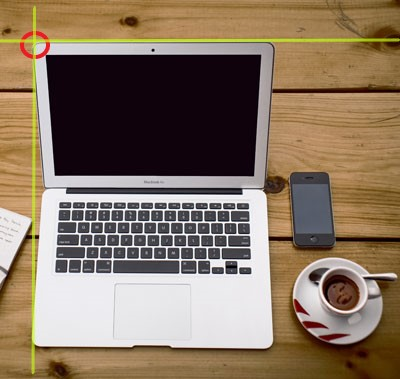
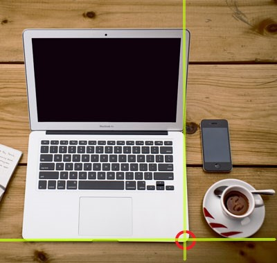

# HTML Image Maps
- HTML 이미지 맵(Image Map)을 사용하면 이미지에서 클릭 가능한 영역을 만들 수 있다.

## Image Maps
- HTML `<map>` 태그는 이미지 맵을 정의한다. 이미지 맵은 클릭 가능한 영역이있는 이미지이다. 영역은 하나 이상의 `<area>` 태그로 정의된다.

## How Does it Work?
- 이미지 맵의 개념은 이미지에서 클릭하는 위치에 따라 다른 작업을 수행 할 수 있어야 한다는 것이다.
- 이미지 맵을 만들려면 이미지와 클릭 가능한 영역을 설명하는 HTML 코드가 필요하다.

## 1. The Image
- 이미지는 `` 태그를 사용하여 삽입된다. 다른 이미지와의 유일한 차이점은 `usemap` 속성을 추가해야한다는 것이다.
```html

```
- `usemap` 값은 해시 태그 `'#'`와 이미지 맵 이름으로 시작하며 이미지와 이미지 맵 간의 관계를 만드는 데 사용된다.
> Tip: 모든 이미지를 이미지 맵으로 사용할 수 있다!

## 2. Create Image Map
- 그런 다음 `<map>` 요소를 추가한다.
- `<map>` 요소는 이미지 맵을 만드는 데 사용되며 필수 `name` 속성을 사용하여 이미지에 연결된다.
```html
<map name="workmap">
```
- `name` 속성은 ``의 `usemap` 속성과 동일한 값을 가져야한다.

## 3. The Areas
- `<map>`을 정의한 후, 클릭 가능한 영역을 추가한다.
- 클릭 가능한 영역은 `<area>` 요소를 사용하여 정의된다.
### Shape
- 클릭 가능한 영역의 모양을 정의해야하며 다음 값 중 하나를 선택할 수 있다.
  - `rect`: 직사각형 영역을 정의한다.
  - `circle`: 원형 영역을 정의한다.
  - `poly`: 다각형 영역을 정의한다.
  - `default`: 전체 지역을 정의한다.
- 또한 이미지에 클릭 가능한 영역을 배치 할 수 있도록 일부 좌표를 정의해야한다.
### Shape="rect"
- shape = "rect"의 좌표는 쌍으로되어 있는데, 하나는 x 축용이고 다른 하나는 y 축용이다.
- 따라서 좌표 34, 44는 왼쪽 여백에서 34 픽셀, 상단에서 44 픽셀에 위치한다.



- 좌표 270, 350은 왼쪽 여백에서 270 픽셀, 위쪽에서 350 픽셀에 있다.



- 이제 클릭 가능한 직사각형 영역을 생성하기에 충분한 데이터가 있다.
```html

<map name="workmap">
  <area shape="rect" coords="34, 44, 270, 350" href="computer.htm">
</map>
```
### Shape="poly"
- shape = "poly"는 직선 (다각형)으로 형성된 모양을 만드는 여러 좌표 점을 포함한다.
- 이 속성 값은 모든 모양을 만드는 데 사용할 수 있다.
```html

<map name="bread">
  <area shape="poly" coords="140,121,181,116,204,160,204,222,191,270,140,329,85,355,58,352,37,322,40,259,103,161,128,147" href="croissant.htm">
</map>
```

## Image Map and JavaScript
- 클릭 가능한 영역은 JavaScript 기능을 트리거 할 수도 있다.
- JavaScript 함수를 실행하려면 `<area>` 요소에 클릭 이벤트를 추가한다.
```html
<map name="workmap">
  <area shape="circle" coords="337,300,44" onclick="myFunction()">
</map>

<script>
function myFunction() {
  alert("You clicked the coffee cup!");
}
</script>
```